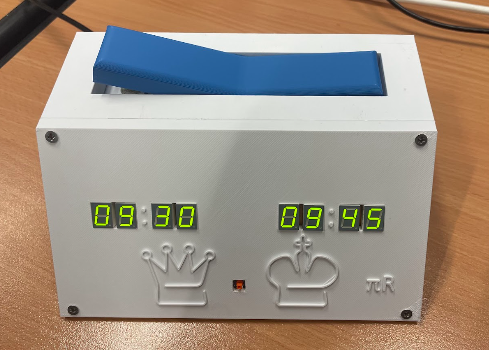
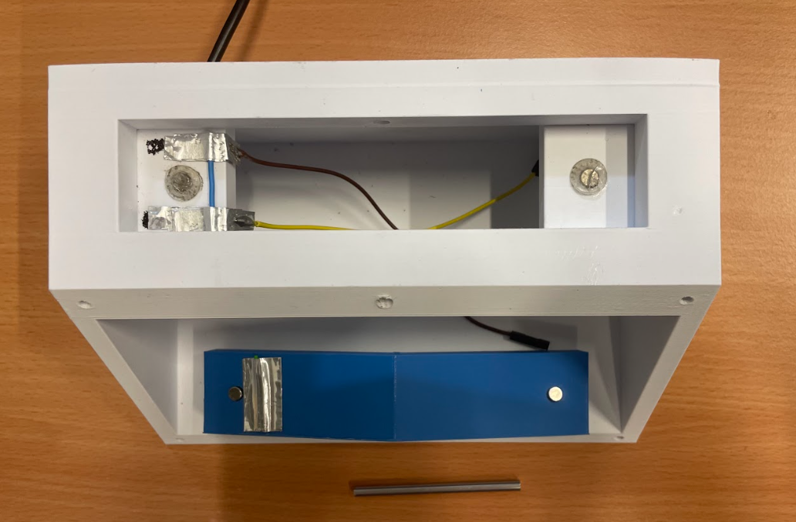
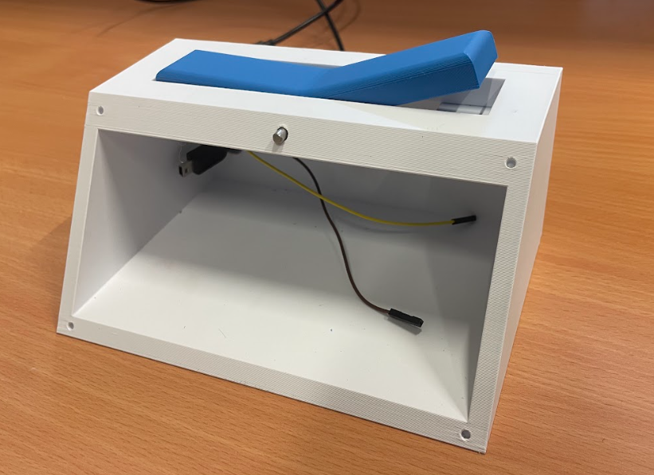
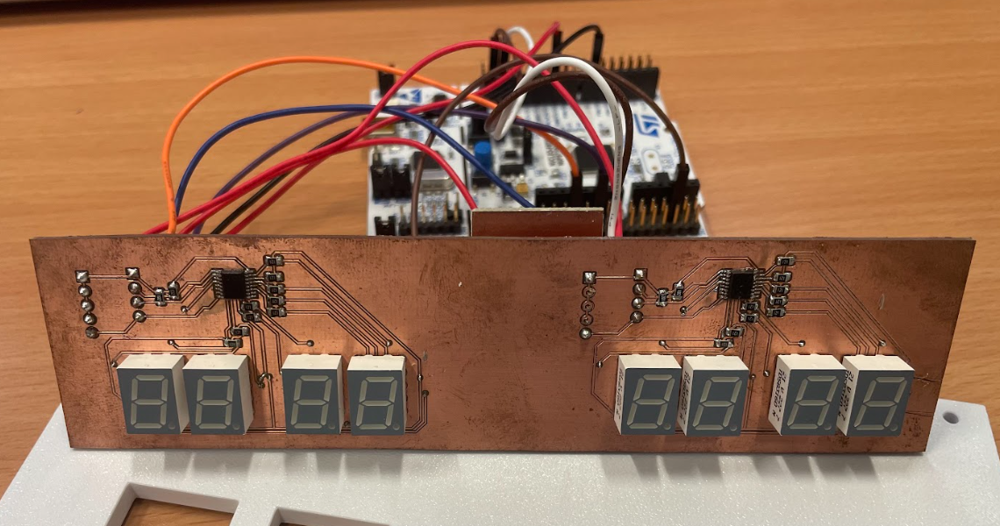
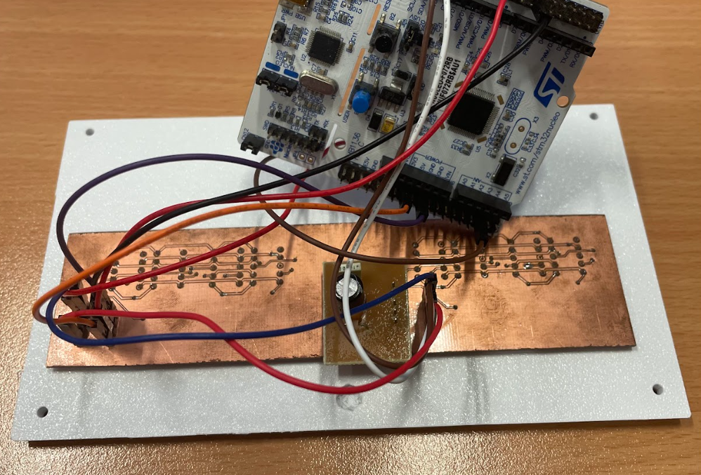

# Chess Clock using STM32

A fully functional chess clock built with an STM32 microcontroller, using hardware timers and external components for a realistic, competitive experience. This project combines embedded programming, electronics, and 3D printing.

---

## Required Equipment

1. **STM32F072RB** microcontroller (or any STM32 with hardware timers)
2. **3D-printed enclosure**
3. **5V power supply** (via USB power bank)
4. **4 screws** (for enclosure assembly)
5. **Shaft** – 3.5mm diameter, 6cm long
6. **4 magnets**
7. **8-digit 7-segment display**  
   [TDSG3160-M – Vishay](https://fr.farnell.com/vishay/tdsg3160-m/7-seg-display-com-cathode-grn/dp/3777869)
8. **2 LED display drivers**  
   [MAX6958AAEE – Analog Devices](https://fr.farnell.com/analog-devices/max6958aaee/driver-afficheur-led-40-a-125/dp/2516031)
9. **Passive components**: resistors, capacitors, tactile button, etc.

---

## Tools Used

- [KiCad](https://kicad.org/) – for PCB design
- [STM32CubeIDE](https://www.st.com/en/development-tools/stm32cubeide.html) – for firmware development

---

## Project Overview

The chess clock is powered by an **STM32F072RB**, using two hardware timers (TIM6 and TIM7) to track each player's countdown in real time. Turn switching is handled by a physical mechanism using a rotating shaft and magnets. Two **MAX6958** drivers control the 7-segment displays. The clock supports multiple time modes and optional time increments.

---

## Assembly Guide

### 1. Print the Enclosure

- Insert magnets into the 4 dedicated holes.
- Create a custom push-button using aluminum (as shown below):

  

- Connect the button between **5V** and **PB0**.
- Drill a hole in the enclosure to pass the power cable.

  

### 2. Prepare the Electronics

  

- Use **4 pull-up resistors** (1kΩ) for I2C communication.
- Use **9 resistors** (330Ω) for the LED segments.
- Connect the first display driver to:  
  - 3.3V, GND  
  - PB8 (SCL), PB9 (SDA)

- Connect the second driver to:  
  - 3.3V, GND  
  - PB10 (SCL), PB11 (SDA)

> Don't forget to add **decoupling capacitors** near the power pins.

  

---

## Repository Structure

- `3D_model/` – 3D-printable enclosure files (STL)
- `software_STM32/` – STM32 firmware (C)
- `Image/` – Photos
- `hardware_kicad/` – Schematics and PCB files
- `README.md` – This file

---

Feel free to clone the repository, give feedback, or open issues!
